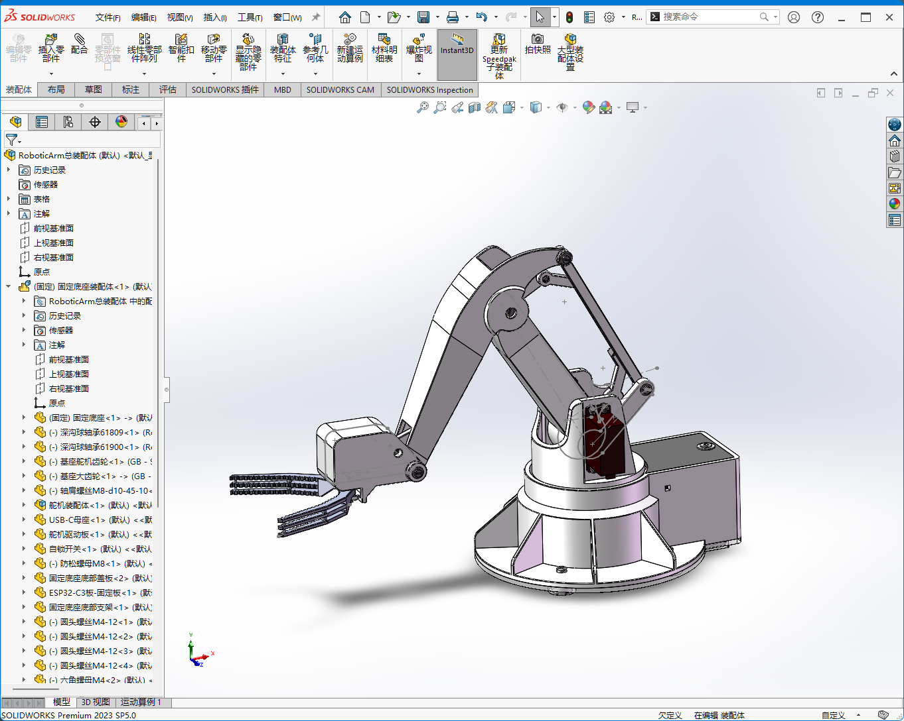

# Robotic Arm

Robotic Arm是一个开源机械臂，采用ESP32-C3芯片通过PCA9685芯片控制4路舵机，使用Xbox兼容手柄遥控。

<iframe style="width:100%;height:400px" src="https://player.bilibili.com/player.html?bvid=BV1EWz1YaE7P&autoplay=0" allowfullscreen></iframe>

## 目录结构说明

- solidworks-model：SolidWorks 2023模型源文件。
- 3d-printable：可用于3D打印的模型文件，由SolidWorks导出：
  - step：Step格式（推荐使用，如果打印机支持Step格式）。
  - stl：STL格式（通用可打印格式）。
  - 3mf：可直接打印的3D打印格式。
- esp32-controller：ESP-IDF工程源码。
- docs：相关资料。

## 设计

使用SolidWorks 2023设计建模。

## 控制

使用MG996Rx3、MG90S舵机，ESP32-C3主控，PCA9685舵机驱动板，Xbox兼容手柄。

## 文档

[软件设计文档](https://liaoxuefeng.com/blogs/all/2024-12-03-robotic-arm/index.html)

## 物料清单

| 名称                    | 数量 | 参考单价 (CNY) | 参考购买链接 | 说明 |
|-------------------------|---|----|---------------------------|------|
| 3D打印零件               | 1 | 70 | 使用FDM 3D打印 | 约700g PLA材料 |
| 深沟球轴承61809          | 1 | 4 | https://detail.tmall.com/item.htm?id=558165998149&skuId=3632300271694 | 固定底座旋转轴(上) |
| 深沟球轴承61900          | 1 | 1 | https://detail.tmall.com/item.htm?id=558028332089&skuId=3466348596124 | 固定底座旋转轴(下) |
| 深沟球轴承619-5          | 2 | 1 | https://detail.tmall.com/item.htm?id=665677732947&skuId=4803499105837 | 旋转底座主摇杆 |
| igus法兰轴承GFM-04050-04 | 20 | 4 | https://item.taobao.com/item.htm?id=577055358668&skuId=3973097699261 | 连接杆 |
| igus法兰轴承GFM-0506-05  | 4  | 3 | https://item.taobao.com/item.htm?id=577055358668&skuId=3917924689834 | 连接杆 |
| 轴肩螺丝M8-d10-45-10     | 1 | 3 | https://item.taobao.com/item.htm?id=727328728239&skuId=5220634259143 | 固定底座主杆 |
| 轴肩螺丝M4-d5-30-5       | 1 | 2 | https://item.taobao.com/item.htm?id=727328728239&skuId=5220634259095 | |
| 轴肩螺丝M4-d5-20-5       | 1 | 1 | https://item.taobao.com/item.htm?id=727328728239&skuId=5220634259093 | |
| 轴肩螺丝M3-d4-20-4       | 3 | 2 | https://item.taobao.com/item.htm?id=727328728239&skuId=5220634259082 | |
| 轴肩螺丝M3-d4-12-4       | 7 | 2 | https://item.taobao.com/item.htm?id=727328728239&skuId=5220634259079 | |
| 防松螺母M8               | 1 | 1 | https://item.taobao.com/item.htm?id=39801137771&skuId=3179651418712 | |
| 防松螺母M4               | 2 | 1 | https://item.taobao.com/item.htm?id=39801137771&skuId=3179651418702 | |
| 防松螺母M3               | 10 | 1 | https://item.taobao.com/item.htm?id=39801137771&skuId=3179651418705 | |
| 圆头螺丝M4-12            | 4 | 1 | https://item.taobao.com/item.html?id=559706384805&skuId=4924704353913 | |
| 圆头螺丝M2.5-12          | 12 | 1 | https://item.taobao.com/item.html?id=559706384805&skuId=4924704353893 | 用于安装MG996R舵机 |
| 圆头螺丝M2-20            | 2 | 1 | https://item.taobao.com/item.html?id=559706384805&skuId=4924704353971 | 用于安装MG90S舵机 |
| 圆头螺丝M2-8             | 2 | 1 | https://item.taobao.com/item.html?id=559706384805&skuId=4924704353888 | |
| 六角螺母M4               | 4 | 1 | https://item.taobao.com/item.htm?id=39801137771&skuId=3179651418702 | |
| 六角螺母M2.5             | 12 | 1 | https://item.taobao.com/item.htm?id=39801137771&skuId=3179950216671 | |
| 六角螺母M2               | 2 | 1 | https://item.taobao.com/item.htm?id=39801137771&skuId=3179950216672 | |
| MG90S/180度             | 1 | 17  | https://detail.tmall.com/item.htm?id=530629424244&skuId=4179287423050 | 用于前爪的微型舵机 |
| MG996R/180度            | 3 | 23  | https://detail.tmall.com/item.htm?id=530629424244&skuId=4179287423040 | 用于固定底座和移动底座的小型舵机 |
| ESP32-C3开发板          | 1 | 20 | https://detail.tmall.com/item.htm?id=802840084513&skuId=5465032488648 | 机械臂控制MCU，内置WiFi/2.4G和蓝牙BLE 5 |
| 16路PWM舵机驱动板        | 1 | 27 | https://detail.tmall.com/item.htm?id=624505789589&skuId=5054325653554 | 使用I2C接口的舵机驱动板，最多能同时驱动16路舵机 |
| 固定卡扣                 | 1 | 6 | https://item.taobao.com/item.htm?id=812206553246&skuId=5676343543601 | 将机械臂固定在桌面 |
| 12mm自锁开关             | 1 | 5 | https://detail.tmall.com/item.htm?id=607769066907&skuId=5258355114246 | 机械臂电源开关 |
| 12mm自锁开关连接器        | 1 | 2 | https://detail.tmall.com/item.htm?id=607769066907&skuId=4419711093384 | 建议购买，免去焊接 |
| 盖世小鸡启明星游戏手柄    | 1 | 80 | https://detail.tmall.com/item.htm?id=749611763829&skuId=5169816701870 | Xbox兼容手柄，支持蓝牙BLE 5 |
| 10cm杜邦线               | 3 | 3 | https://detail.tmall.com/item.htm?id=14466195609 | 建议购买公对公、公对母、母对母排线，免去焊接 |

## 参考资料

- [阿奇SolidWorks教程](https://www.bilibili.com/video/BV1iw411Z7HZ/)
- [阿奇讲SolidWorks机械臂](https://www.bilibili.com/cheese/play/ss865)
- [ESP32教程（基于ESP-IDF）](https://www.bilibili.com/video/BV1eRg7exEcT/)
- [乐鑫全球开发者大会｜嵌入式系统中的低功耗蓝牙开发](https://www.bilibili.com/video/BV1kh4y1Y7GU/)
- [ESP32 PWM Driver](https://github.com/brainelectronics/esp32-pca9685)
